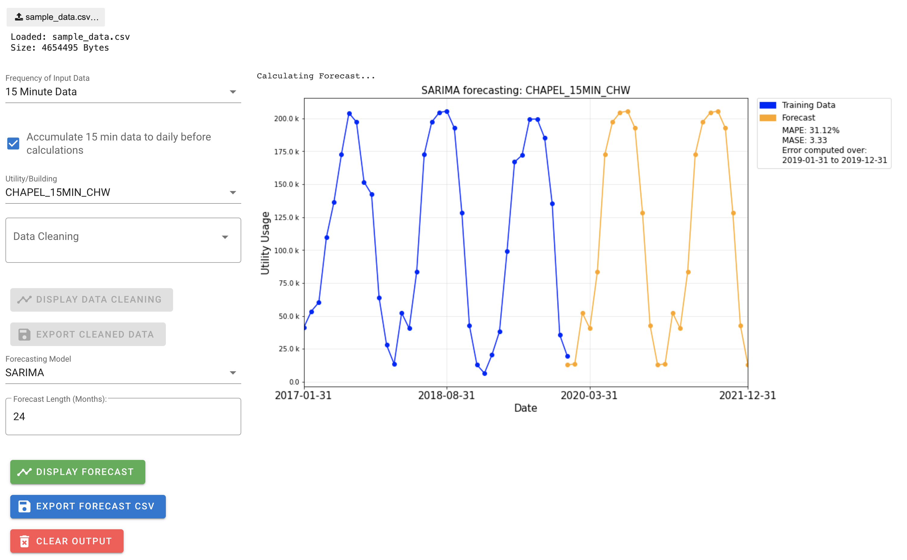

# Utility Forecasting for Duke University

Working with Duke’s Facilities Department, we have developed a tool which allows the cleaning and forecasting of utility usage data, for use in accurate budgeting and planning of new buildings.

## Installation/Usage

### Linux/Mac OS
0. You will need both python 3 and pip - see https://www.python.org/downloads/ (pip is typically included by default for Python 3.4+)
1. Clone (or download) this repo: `git clone https://github.com/epswartz/utility-forecasting.git`
2. Go into the directory and install the required packages: `cd utility-forecasting; pip install -r requirements.txt`
3. Run: `voila Forecasting_Tool.ipynb --VoilaConfiguration.file_whitelist="['.*\.csv']"`
4. A browser window should open displaying the tool, but if not, you can navigate to http://localhost:8866 yourself.

### Windows
If you'd like to use the tool on windows, our recommendation is that you install it on a linux machine, and talk to it through the web browser - the application should be available on port `8866` of the server by default. Alternatively, you may be able to get it running by installing python, pip and jupyter on your machine, and running the tool as a regular jupyter notebook without voila - we've had a lot of problems with Voila and Windows.

### Input Data Format
Excel file with first column labelled as "dt" representing the time/ date the data was recorded and the rest of the columns hold different building's data.

#### Available Date Formats
* `%m/%d/%y %I:%M %p`
* `%y-%m-%d`
* `%y/%m/%d`
* `%y-%m`
* `%y/%m`

### Sample Data
Sample data is provided in `sample_data/sample_data.csv`. To use this data, choose `15 Minute Data` for "Input Data Frequency" after you upload the data.

## Team

### Project Team Members
* Ethan Swartzentruber
* Grace Llewellyn
* Shota Takeshima

### Project Manager
* Billy Carson

### Project Sponsors
* John Haws
* Gagan Kaur
* Wendy Lesesne
* Casey Collins
